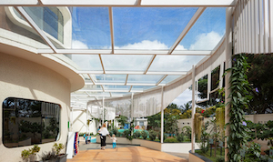
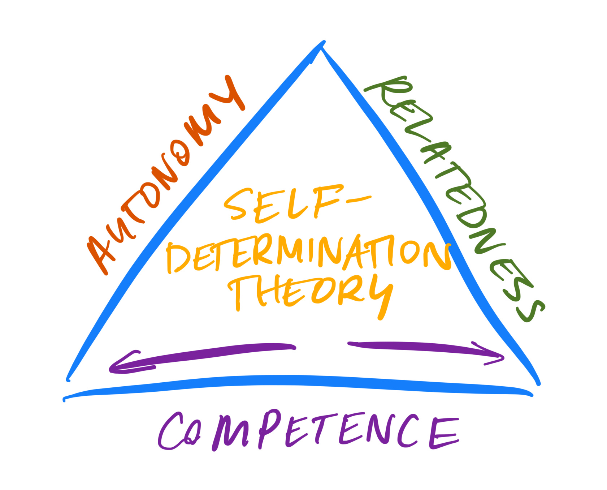
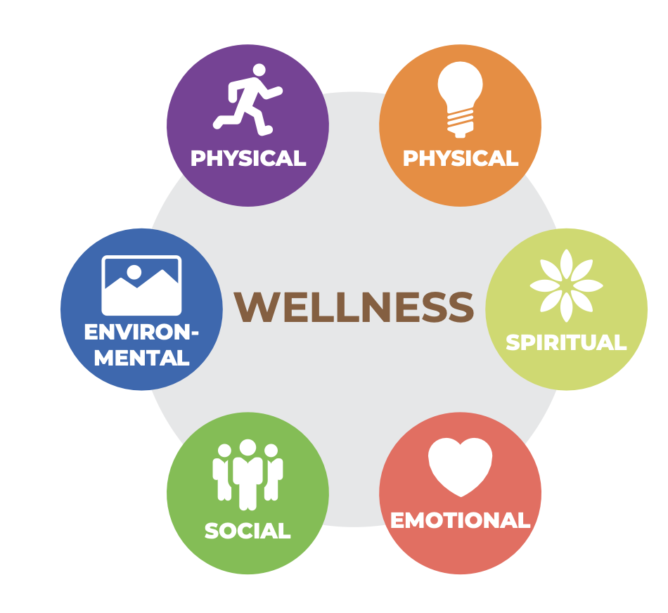
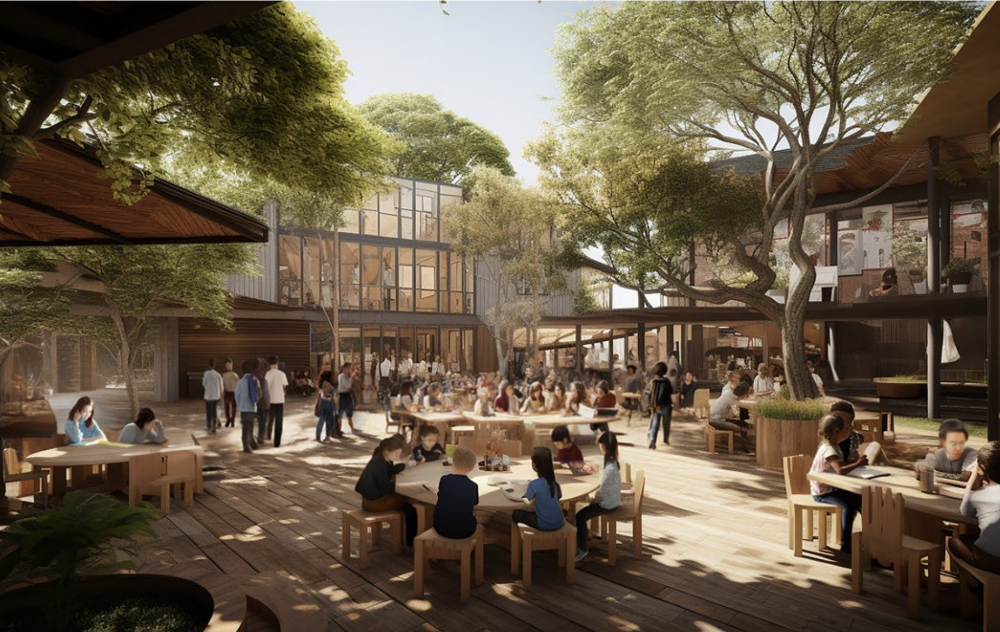
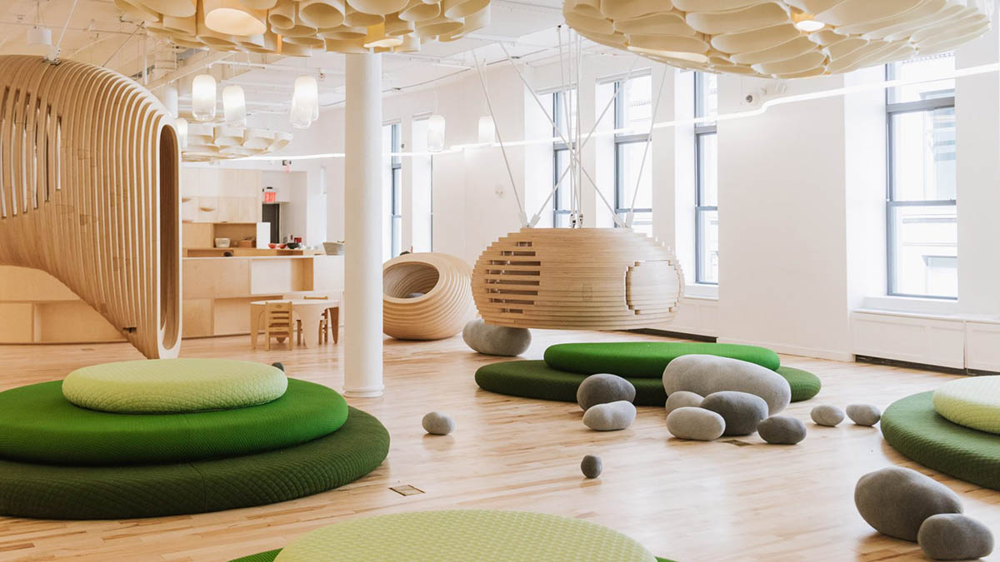
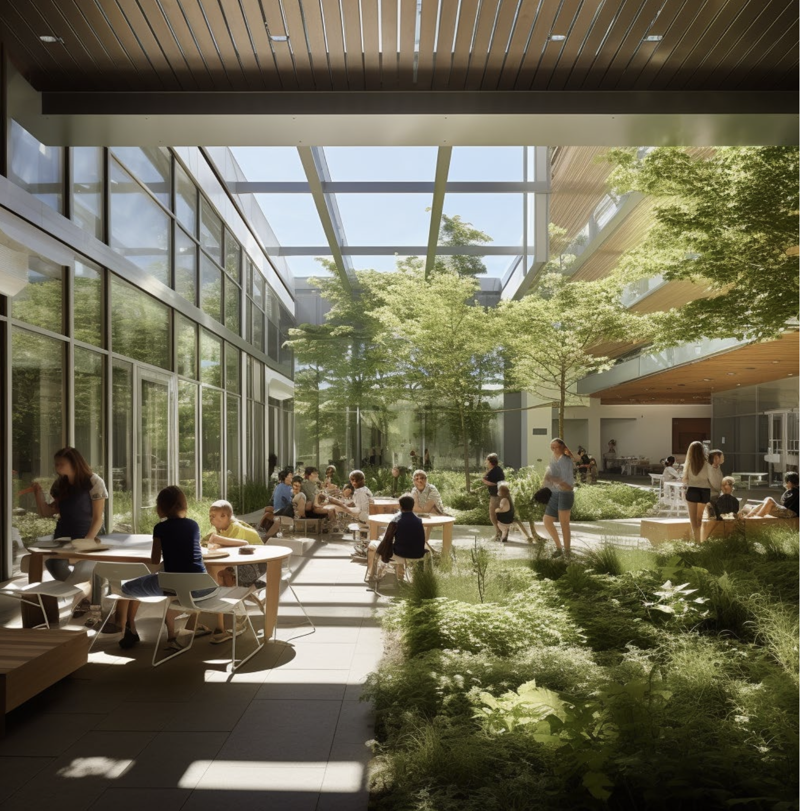
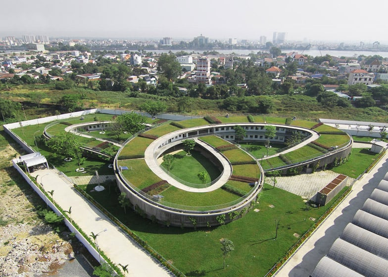

<section>
	<h4>About Sankoré</h4>
	
We have created Sankoré to be an indelible experience for nurturing learners. All aspects of our institution have been designed with interconnectedness in mind - the relationship between what we're learning, how we're learning, where we're learning, and with whom we're learning have all been meticulously considered and built with relentless precision. Our partnerships with leading global institutions and progressive designers at Education Design International, PlussEd+, The Chapin School, The Riverdale School, Delta Global and countless others have produced an institution for leading and innovation like nowhere else in the world.

	
Our approach to learning is drawn from leading research and practices around the globe and designed with the 21 Century Learner at the center of facilitation. When we consider the whole child, we are mindful of their growth not only in traditional academic areas, but their co-curicular life as well. We provide state of the art facilities and instruction in the arts, technology and innovation, environmental stewardship, sporting and competition, and mindfulness.

  <header>
		

		

			

			

			

		

	

  

	<header>
		<h5>Our Learning Campus</h5>
		
Where will our children be learning?

	</header>
	
Our campus is seated in the heart of Nairobi, nestled among the Acacia and Jacaranda, abutting water and is easily accessible by car but feels peaceful and secluded from the bustle of city life. All our facilities have been designed without compromise to reflect our approaches to learning. Our guiding principles can be found among the world's leading educational designers and include Powered by AI, Neuroarchitecture, Biophilic Design, Salutogenic Design, Outdoor Learning, Self Determination Theory, and Choice Architecture. Sankoré is designed to promote student health and well-being while maintaining access to challenging and thought provoking academic work. There is an indestructible relationship between what we are learning and where we are learning.
 
 

		

			

			

		

	

Our current campus design and layout combines our pool, sports fields, state of the art performance spaces with our progressive treehouses, learning pods, arts studios, and modular experiential learning labs. We are networked for the future and beyond while at the same time placing extreme importance on our relationship and stewardship of the natural world. We celebrate both the Silicon Savannah and the physical Savannah.

	  

		

			

			

			

		

	

