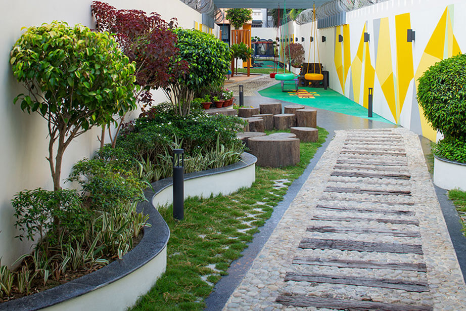
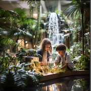

<section>
	<h4>Our Approach to Community Building</h4>
	
Admissions to Sankoré International School is currently <strong>invite-only</strong>. We mindfully and intentionally build our indelible learning communities of explorers, innovators, and change makers with patience and precision. In the spring of 2024, we will be reviewing our next round of invite requests for application. Our experiential approaches to learning environments and holistic discovery create a vibrant learning community comprised of students from all walks of life. True to SHOFCO's mission, we're building grassroot networks of change-makers and investing in all youth, regardless of soceoeconomic status and privledge.

	<header>
		

		

			

		

	

	</header>
	

	<header>
		<h5>What does Sankoré look for in learners?</h5>
		
How can our family understand if we are a good fit for Sankoré?

	</header>
	
Our learners are the next generation of leaders, change-makers, activists, and innovators. They are the individuals creating the job opportunities for others. What is most important to us? The same thing that is most important to you - who your child is now and who your child will become. What supports can we, as a comminity, provide for that child to grow beyond their greatest potential? With that in mind, our admissions process is not assessment based. Your child will not have to sit for academic and behavorial assessments and surveys, nor will you as their family. Instead, we invite learners to share with us who they are, their current wishes and dreams, through whatever means they choose. We have recieved "day in the life" video submissions, poster presentations, artwork, and even mock presidential campain posters and speeches. Our requirement is to answer the decptively simple question: <i>Who are you, truly?</i> Who are you as an individual and who are you as a family? Further details regarding our admissions process are provided when invitations for our next round of learners are sent out each year.

	

	<header>
		<h5>School Calendar</h5>
	</header>
	
Our school schedule follows an American aligned schedule, as many of our graduates explore university experiences in the United States. This is a September - June calendar with extended breaks in December and April and Kenyan Holidays observed. Our year is broken into 2 Semesters/4 terms in alignment with American schooling structures. 

	

	<header>
		<h5>School Fees</h5>
		</header>
	
Our tuition is currently $4000 USD per semester for preprimary, $4500 USD per semester for primary, and $5000 USD per semester for high school. These prices are subject to adjust on an annual basis. There is a one-time capital levy of $3000 USD per child due upon admission.

	
