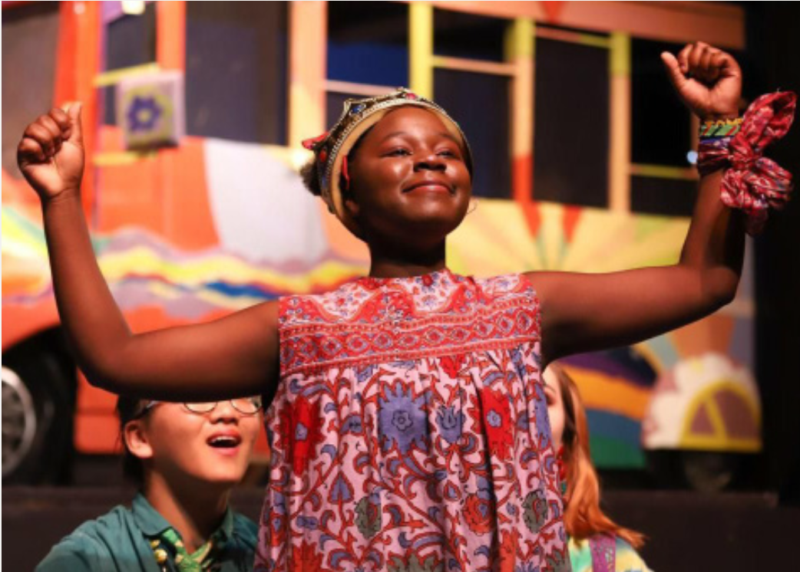

---

layout: page

title: Graduates

description: Where will go go with a SHOFCO education?

---

<section>

<h4>Where do SHOFCO students go after graduating?</h4>

SHOFCO has a storied past with American prep schools and universities. We are constantly having to respond to requests from schools like Taft, Chapin, Columbia University, Loomis Chaffe, Conneticut College, all of which are clamoring for more SHOFCO graduates. The relationships that we have developed with many of the most exclusive learning institutions in the United States are built on an unshakable reputation for producing not only excellent students, but ones with a unique and valued perspective on affecting change in our global communities.

<blockquote>We have been in parnership and discussions with many universities throughout the development of Sankoré and we continually hear the same refrain over and over. "We cannot wait for your first round of graduates to start applying."</blockquote>

</section>

<section>
<h5>Graduate Profiles</h5>

After graduating from SHOFCO schools, many of our students have traveled to America to continue their education. We currently have students (all receiving full scholarships) at Columbia University, Amherst College, Skidmore College, Wesleyan University, University of Hartford, Trinity University, Connecticut College, Susquehanna University, Franklin & Marshall, and Drexel University. For our students that have elected to do their high school experiences in the United States, SHOFCO has had students at Taft, Brooks, Loomis-Chaffee, Episcopal, Madeira, Miss Porters, Buffalo SEM, Stoneleigh-Burnham, Wasatch, and Westover. 

Our graduates vary widely in their views and approaches to the world, though they carry with them many of the foundational ideals instilled in them by SHOFCO. Our young scholars hold leadership positions in student government and on sports teams, have created initiatives and campaigns for the betterment of their schools and for Kenya, and have shouldered the weight of cultural ambassadors with pride and honor. Students have launched non-profits, received summer fellowships at prestigious law firms, raised funds for community service projects, and actively worked to break down stereotypes about Kenya and broader Africa.

</section>